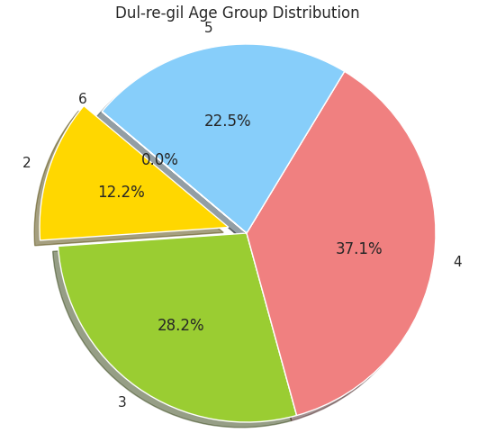
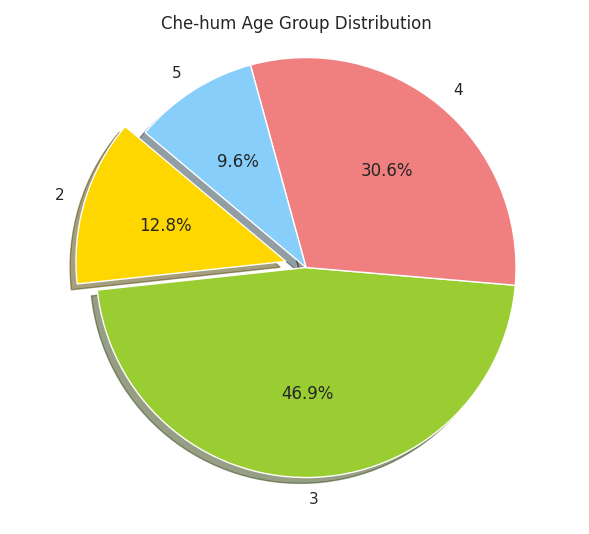

# 사용 데이터
둘레길 관심인구 정보 - FPL010101.csv (인코딩 : CP949)
등산로 관심인구 정보 - FPL020101.csv

vs

산림체험 관심인구 정보 - FPL060101.csv (인코딩 : CP949)

위의 이 3가지 테이블의 스키마가 동일해 분석하기 가장 좋아 이들을 선택했습니다.

이외의 데이터는 스키마도 다르며 피처를 뽑기 어렵습니다.
(이유)

   

# 분석 전 주의사항
산림빅데이터 거래소에서 테이블을 다운로드 한 이후, 해당 파일을 메모장으로 연결하여 연 후, 다른 인코딩(utf-8 or ANSI)으로 연결하여 다른 이름으로 저장을 한 번 진행해 주신 후 분석을 시작하면 좋습니다.

또한 위 작업 이후에도 인코딩이 원하는 대로 이뤄지지 않을 수 있어 분석 전 해당 파일의 인코딩 정보를 알아내야 합니다.

아래 파이썬 코드로 파일의 인코딩 정보를 알아낼 수 있습니다.

import chardet

import os

#현재 폴더 경로; 작업 폴더 기준

print(os.getcwd())

os.chdir("[원하는 경로]")

print(os.getcwd())

#파일 경로
file_path = 'FPL010101txt.txt'

#파일을 바이트 모드로 읽기

    with open(ile_path, 'rb') as f:
        raw_data = f.read()
    

    

#chardet을 사용하여 인코딩 확인

        result = chardet.detect(raw_data)

        encoding = result['encoding']

        confidence = result['confidence']

        print(f"The detected encoding of the file is {encoding} with confidence {confidence}.")

   

# EDA 결과 1
### 나이대에 따른 둘레길/등산로 vs 산림체험 선호 유무 존재

아래는 **관심인구 정보**를 나이대 별로 요약 후 count한 결과입니다.

(주피터 노트북 내) 코드 :

    df = pd.read_csv('/content/sample_data/FPL010101txt.txt', encoding ='cp949')

**나이 그룹 별로 그룹화한 후에 count**

        grouped = df.groupby(['age_group_cd']).size().reset_index(name='count')

        print(grouped)

결과 :

**둘레길/등산로**

    age_group_cd  count

          2        5417
          3       12499
          4       16451
          5        9998
          6           8

**산림체험**

    age_group_cd  count

          2         1278
          3         4678
          4         3051
          5          959

age_group_cd에 대한 결과값은 다음 의미를 가집니다.

    2 : 20 대
    3 : 30 대
    4 : ...
    5 : ...
    6 : ...

### 20대는 숲체험 과 둘레길을 비슷한 정도로 선호합니다.
### 30대는 숲체험을 더 선호하는 경향이 있습니다.
### 40대는 둘레길을 약간 더 선호하는 경향이 있습니다.
### 50대는 둘레길을 더 선호하는 경향이 있습니다.

# EDA 결과 2
